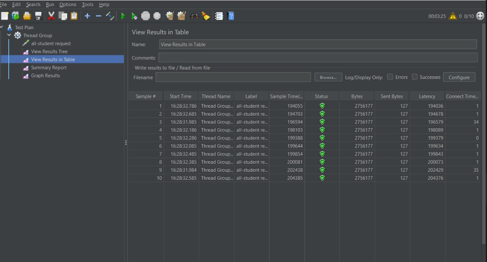
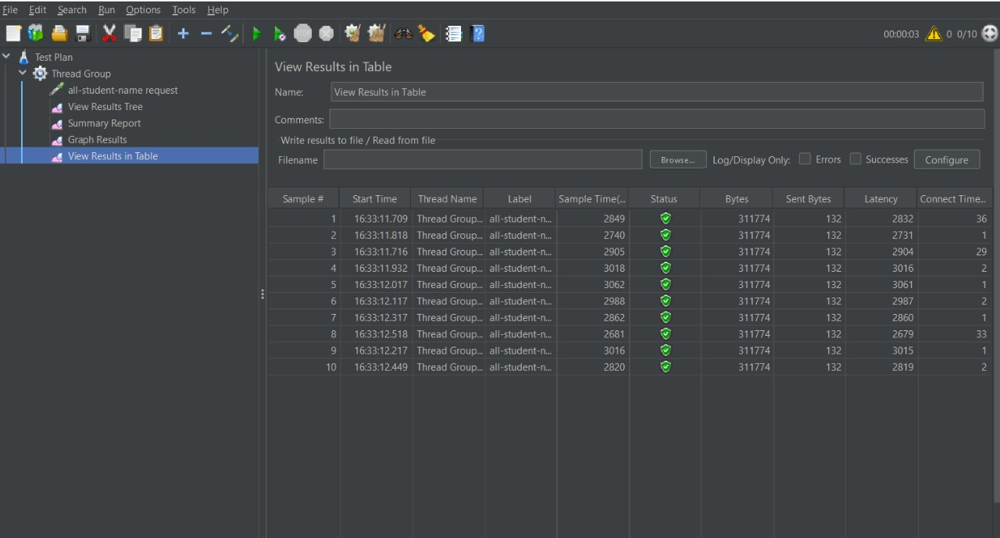
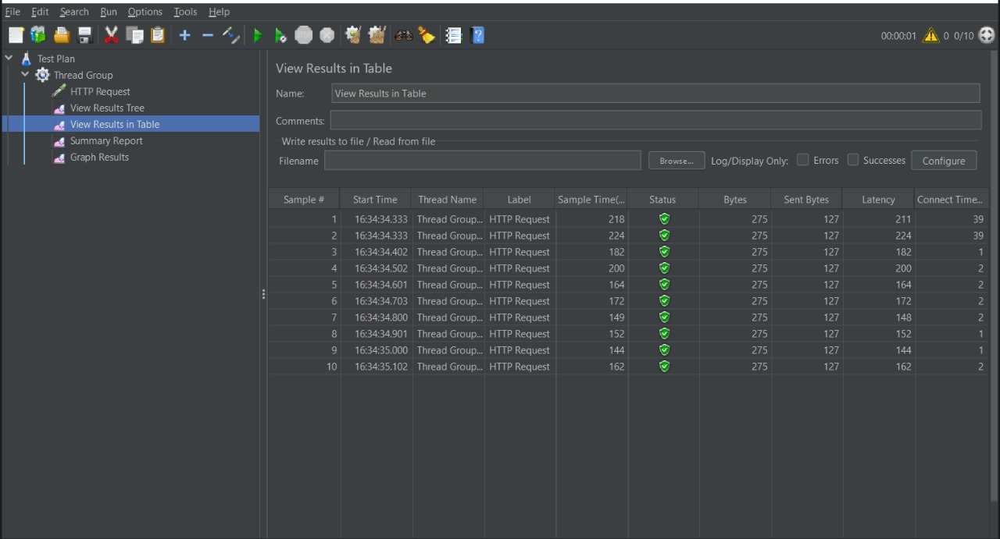
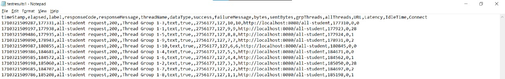
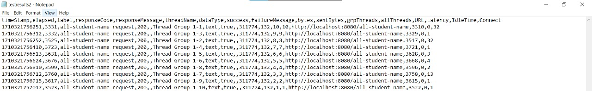
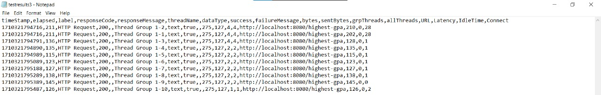
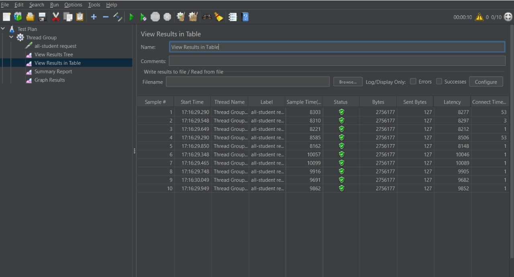
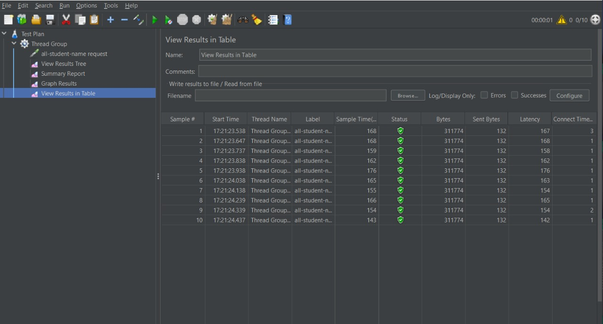
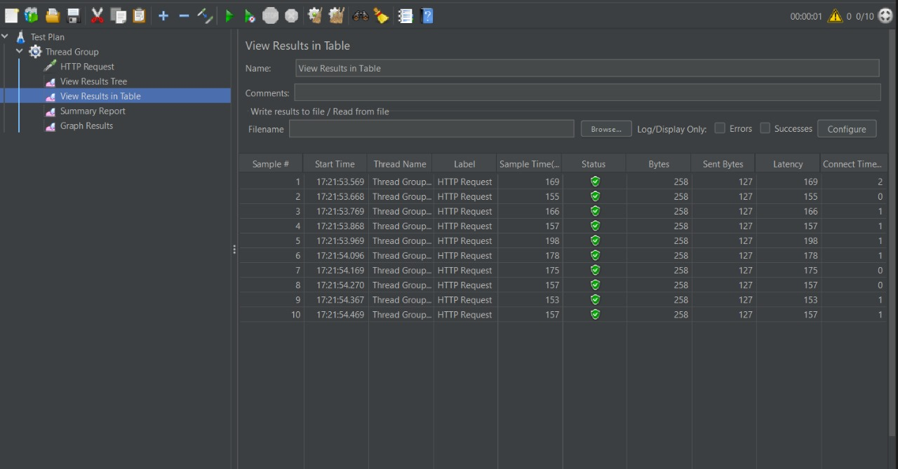

## Result Images

Hasil JMeter GUI (Before refactor profiling):  
  
  

Hasil JMeter CMD (Before refactor profiling):  
  
  

Hasil JMeter GUI (After refactor profiling):  
  
  

- Dapat kita lihat setelah melakukan refactor, perbedaan waktu menurun bahkan lebih dari 20%. Contohnya, dari `/all-student` waktu awal 1904055 menjadi 8303. Hal ini juga berlaku di `/highest-gpa` dan `/all-student-name` perbedaan waktu sangat signifikan. Hal ini menunjukkan bahwa optimasi dengan refactoring fungsi berpengaruh juga terhadap pengujian aplikasi menggunakan JMeter.

## Reflection
- What is the difference between the approach of performance    testing with JMeter and profiling with IntelliJ Profiler in the context of optimizing application performance?
    - JMeter digunakan untuk melakukan pengujian dengan endpoint, artinya JMeter melakukan uji coba layaknya di dunia nyata. Sedangkan, IntelliJ Profiler lebih berfokus pada tingkat code.IntelliJ Profiler lebih spesifik melakukan uji coba pada areat tertentu.

- How does the profiling process help you in identifying and understanding the weak points in your application?
    - Dengan profiling kita dapat mengetahui titik lemah dari kode ataupun aplikasi kita. Dengan begitu, kita dapat memaksimalkan kinerja dari aplikasi kita sehingga nyaman untuk digunakan dan terhindar dari bug. Kita juga dapat menghemat waktu dengan tidak mengganti semua bagian code dan hanya melihat bagian yang membuat lemah.

- Do you think IntelliJ Profiler is effective in assisting you to analyze and identify bottlenecks in your application code?
    - Menurut saya, IntelliJ Profiler efektif dalam membantu untuk menganalisis kode saya. Profiler dapat menemukan bagian yang kurang dan saya dapat langsung mencari kesalahan di bagian tersebut. Mulai dari penggunaan CPU, memori, dan waktu yang dibutuhkan. Contohnya,saat `all-student` yang awalnya sangat lambat dengan IntelliJ Profiler saya tahu bagian mana yang membuat itu lambat, yaitu `getAllStudentCourse()`

- What are the main challenges you face when conducting performance testing and profiling, and how do you overcome these challenges?
    - Tantangan utama ketika performance testing dan profiling adalah ketika melihat hasil atau output dari hasil tesnya sendiri. Oleh karena itu, saya harus lebih berhati-hati dan teliti saat membaca hasil dari profiling.

- What are the main benefits you gain from using IntelliJ Profiler for profiling your application code?
    - Keuntugan utama yang saya dapat ketika menggunakan IntelliJ Profiler adalah mencari tahu bottleneck dari program. Saya dapat mencari bagian code yang menyebabkan aplikasi menjadi lambat.

- How do you handle situations where the results from profiling with IntelliJ Profiler are not entirely consistent with findings from performance testing using JMeter?
    - Untuk sejauh ini, saya belum mengalami kondisi seperti itu. Akan tetapi, dari hasil yang saya baca internet hal ini bisa terjadi karena perbedaan environment, perbedaan analysis tool, ataupun dependencies. Hal ini dapat dicegah dengan memastikan testing yang digunakan ekuivalen, memahami perbedaan tool, dan cek faktor eksternal yang dapat memengaruhi.

- What strategies do you implement in optimizing application code after analyzing results from performance testing and profiling? How do you ensure the changes you make do not affect the application's functionality?
    - Strategi saya adalah dengan menggunakan JMeter dan IntelliJ Profiler terlebih dahulu. Setelah teridentifikasi, saya mulai memikirkan hal yang bisa dioptimisasi dari bagian kode yang diberi tahu di IntelliJ Profiler. Saya melihat dari segi kompleksitas, memori yang digunakan, dan efektivitas algoritma secara keseluruhan. Setelah optimisasi bagian tersebut, saya akan mencoba testing kembali dan melihat hasilnya untu melihat adanya perubahan yang terjadi.
